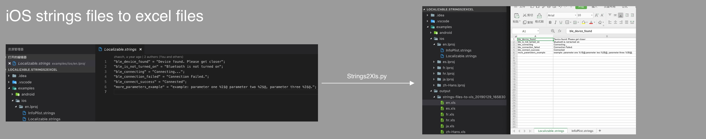
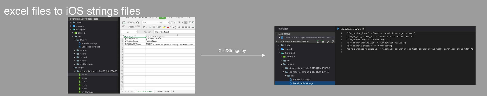
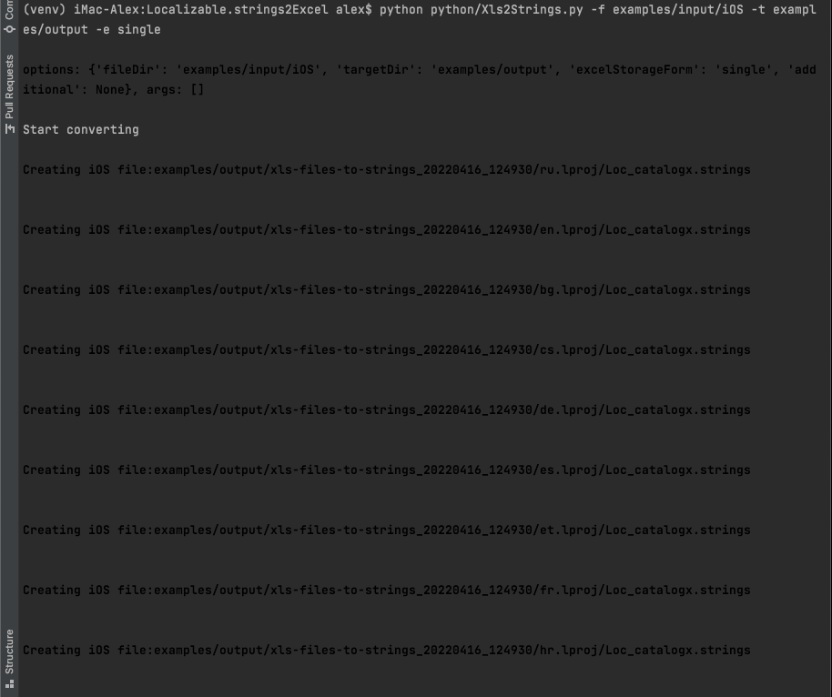
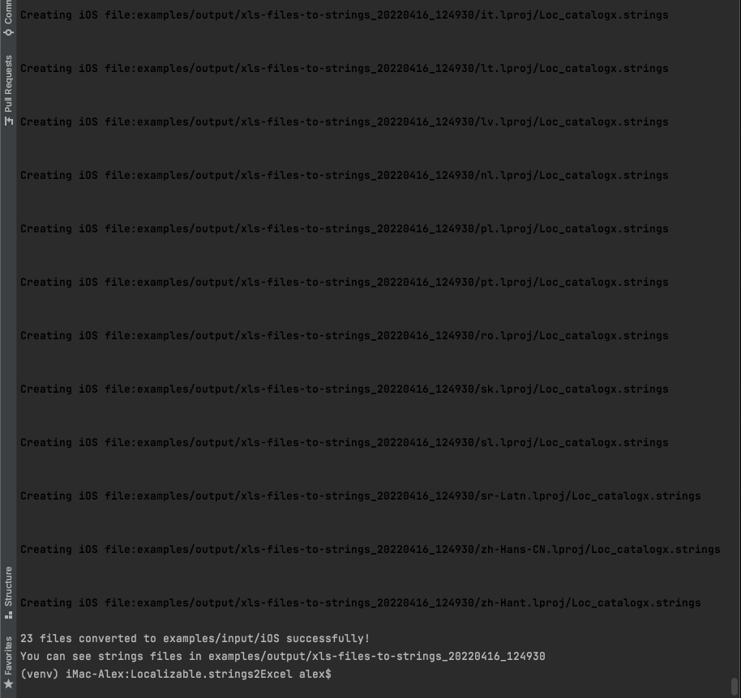
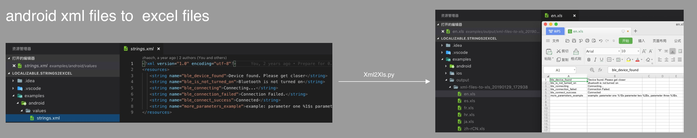
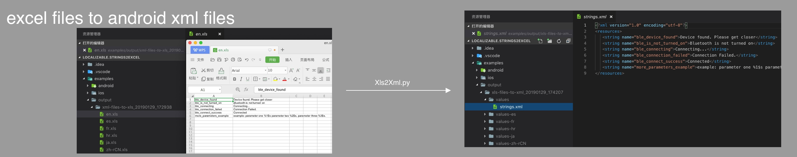
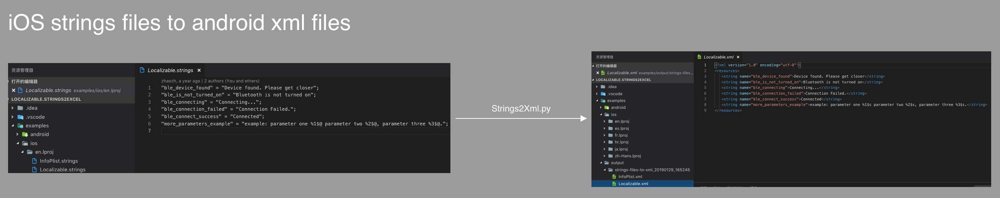

#Do not forget to create and run virtual environment:
# Creating virtual environment:
#$ virtualenv venv -p python3
# Running it:
# $ source venv/bin/activate


# Localizable.strings2Excel

Python command line tool for conversion between iOS strings files and excel files & between android strings.xml files and excl files. & strings files to android strings.xml files.


## Features

- [x] Support convert **iOS** strings files to **excel** files.
- [x] Support convert **excel** files to **iOS** strings files.
- [x] Support convert **android** xml files to **excel** files.
- [x] Support convert **excel** files to **android** xml files.
- [x] Support convert **iOS** strings files to **android** xml files.

## Version

**V1.0.2**

## Required

### 1.Check python version

python version must be 3.9+

```
$ python --version
Python 3.9 or higher 
```

### 2.Check pip(python package manager)

```
$ pip --version


if pip is not installed
Read and install pip
https://pip.pypa.io/en/stable/installation/
```

### 3.Install pyexcelerator

```
sudo pip install pyExcelerator
or 
pip install pyExcelerator
```

### 4.Install openpyxl (legacy xlrd)

```
for .xlsx files openpyxl library should be use instead of xlrd.

pip install openpyxl

[comment]: <> (sudo pip install xlrd)

[comment]: <> (or)

[comment]: <> (pip install xlrd)

```

## Usage

### 1.Convert **iOS** strings files to **excel** files.

```
$ python python/Strings2Xls.py -f examples/ios/ -t examples/output
Start converting
Convert examples/ios/ successfully! you can see xls file in examples/output/strings-files-to-xls_20190129_165830
```



### 2.Convert **excel** files to **iOS** strings files

```
Be sure you install openpyxl
If not yet, then:
$pip install openpyxl

$ python python/Xls2Strings.py -f examples/input/iOS -t examples/output -e single


Where: 
examples/input/iOS is directory where .xlsx file that need to be converte is locate
examples/output is directory where resulting files will be placed
-e single means that .xlsx table file has only 1 sheet

options: {'fileDir': 'examples/output/strings-files-to-xls_20190129_165830/', 'targetDir': 'examples/output/', 'excelStorageForm': 'multiple', 'additional': None
}, args: []

Start converting
Creating iOS file:examples/output/xls-files-to-strings_20220416_123637/ru.lproj/Loc_catalogx.strings

...
23 files converted to examples/input/iOS successfully!
You can see strings files in examples/output/xls-files-to-strings_20220416_123637

Here 23 files means amount of locales that defined in source .xlsx file
```





### 3.Convert **android** xml files to **excel** files

```
First install modules
$ pip install openpyxl


Then run
$ python python/Xml2Xls.py -f examples/android/ -t examples/output -e single

options: {'fileDir': 'examples/android/', 'targetDir': 'examples/output', 'excelStorageForm': 'multiple'}, args: []

Start converting
Convert examples/android/ successfully! you can see xls file in examples/output/xml-files-to-xls_20190129_172938
```



### 4.Convert **excel** files to **android** xml files

```
$ python python/Xls2Xml.py -f examples/output/xml-files-to-xlsx_20220417_110315/values-es -t examples/output/ -e multiple

options: {'fileDir': 'examples/output/Tutorial41 - convert XML spreadsheet to Excel.xlsx/', 'targetDir': 'examples/output/', 'excelStorageForm': 'multiple', 'additional': None}, args
: []

Start converting
Convert examples/output/xml-files-to-xls_20190129_172938/ successfully! you can xml files in examples/output//xls-files-to-xml_20190129_174207
```



### 5.Convert **iOS** strings files to **android** xml files.

```shell
$ python python/Strings2Xml.py -f examples/ios/en.lproj/ -t examples/output/

options: {'fileDir': 'examples/ios/en.lproj/', 'targetDir': 'examples/output/', 'additional': None}, args: []


Creating android file:examples/output//strings-files-to-xml_20190129_164122/Localizable.xml


Creating android file:examples/output//strings-files-to-xml_20190129_164122/InfoPlist.xml


Convert successfully! you can see xml files in examples/output//strings-files-to-xml_20190129_164122

```



## ChangeLog

[ChangeLog](https://github.com/CatchZeng/Localizable.strings2Excel/blob/master/CHANGELOG.md)

## Thanks

- [Buguibu](https://github.com/buguibu)
- [vgutierrezNologis](https://github.com/vgutierrezNologis)
- [linguinan](https://github.com/linguinan)
- [qiusuo8](https://github.com/qiusuo8)
- [light-bo](https://github.com/light-bo)
- [bryant1410](https://github.com/bryant1410)
